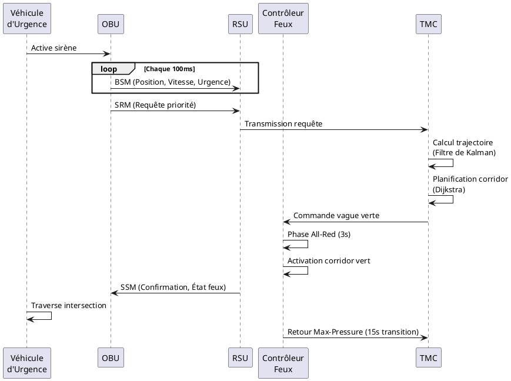

# Guide de Création des Diagrammes pour la Section 3.2.3

## Diagrammes Nécessaires

### 1. Diagramme d'Architecture V2I
**Outil recommandé**: Draw.io (https://app.diagrams.net/)

**Éléments à inclure**:
- OBU (On-Board Unit) - dans le véhicule d'urgence
- RSU (Road-Side Unit) - à l'intersection
- TMC (Traffic Management Center) - backend
- Flèches de communication bidirectionnelle
- Protocole DSRC (5.9 GHz)

**Instructions**:
1. Ouvrir Draw.io
2. Sélectionner "Blank Diagram"
3. Utiliser les formes:
   - Rectangles arrondis pour les unités (OBU, RSU, TMC)
   - Flèches doubles pour la communication
   - Nuages pour représenter les données sans fil
4. Ajouter labels: BSM, SRM, SSM
5. Utiliser couleurs: 
   - Bleu (#2E5C8A) pour infrastructure
   - Rouge (#C41E3A) pour véhicules d'urgence
   - Vert (#4CAF50) pour communication réussie

**Dimensions suggérées**: 1200x800 pixels

---

### 2. Diagramme de Séquence - Communication V2I
**Outil recommandé**: PlantUML ou SequenceDiagram.org

**Participants**:
- Véhicule d'Urgence
- OBU
- RSU
- Contrôleur de Feux
- TMC

**Séquence**:
1. OBU → RSU: BSM (position, vitesse, statut urgence) [10 Hz]
2. OBU → RSU: SRM (requête priorité, ETA)
3. RSU → TMC: Transmission requête
4. TMC → TMC: Calcul trajectoire (Kalman)
5. TMC → TMC: Planification corridor (Dijkstra)
6. TMC → Contrôleur: Commande vague verte
7. Contrôleur → Contrôleur: Phase all-red (3s)
8. Contrôleur → Contrôleur: Activation vert corridor
9. RSU → OBU: SSM (confirmation, état feux)
10. Véhicule traverse intersection
11. Contrôleur → TMC: Retour mode Max-Pressure

**Code PlantUML**:

---

### 3. Machine d'États - Module Fail-Safe
**Outil recommandé**: Draw.io avec formes UML

**États**:
1. **Mode Normal** (vert)
   - Conditions: Tous capteurs OK, latence < 50ms
   - Fonctionnalités: Max-Pressure + V2I actifs

2. **Mode Dégradé 1** (jaune clair)
   - Trigger: Perte 1 capteur OU 1 contrôleur
   - Action: Fusion données, latence < 100ms

3. **Mode Dégradé 2** (orange)
   - Trigger: Perte multiples capteurs
   - Action: Plan semi-adaptatif historique

4. **Mode Sécurisé** (rouge)
   - Trigger: Défaillance critique
   - Action: Feux fixes conservatifs, alerte opérateurs

**Transitions**:
- Normal → Dégradé 1: Détection défaillance simple
- Dégradé 1 → Dégradé 2: Défaillances multiples
- Dégradé 2 → Sécurisé: Défaillance critique OU timeout
- Sécurisé → Dégradé 2: Correction partielle
- Dégradé 2 → Dégradé 1: Restauration capteurs
- Dégradé 1 → Normal: Tous systèmes restaurés

**Conditions**:
- Chaque transition inclut un timeout et un check de santé
- Auto-transition sur chaque état (self-loop) pour monitoring continu

---

### 4. Diagramme d'Intégration Système Complet
**Outil recommandé**: Draw.io avec template "Network Diagram"

**Couches à représenter**:

**Couche Physique** (bas):
- Capteurs (boucles inductives, caméras)
- Contrôleurs de feux (armoires)
- Véhicules avec OBU
- RSU aux intersections

**Couche Communication** (milieu):
- DSRC 5.9 GHz (sans fil)
- Ethernet/Fiber (filaire)
- API REST (HTTP/HTTPS)
- TraCI (TCP)

**Couche Logicielle** (haut):
- SUMO Simulator
- Flask Backend
- PostgreSQL Database
- React Frontend
- Module V2I
- Module Fail-Safe
- Algorithme Max-Pressure

**Flux de données**:
1. Capteurs → SUMO → Flask
2. OBU → RSU → Flask → V2I Module
3. V2I Module → Fail-Safe Module → Contrôleurs
4. Tous → PostgreSQL (logs)
5. Flask → React (visualisation)

---

## Conseils de Design

### Palette de Couleurs Recommandée:
- **Bleu principal**: #2E5C8A (infrastructure, normal)
- **Rouge urgence**: #C41E3A (véhicules d'urgence, alertes)
- **Vert succès**: #4CAF50 (communication OK, mode normal)
- **Jaune attention**: #FFC107 (dégradé 1)
- **Orange warning**: #FF9800 (dégradé 2)
- **Rouge critique**: #F44336 (mode sécurisé)
- **Gris neutre**: #9E9E9E (inactive, secondaire)

### Typographie:
- Titres: Arial Bold, 14-16pt
- Labels: Arial Regular, 10-12pt
- Annotations: Arial Italic, 9-10pt

### Export:
- Format: PNG haute résolution (300 DPI)
- Dimensions: 1920x1080 ou 1600x1200
- Fond: Blanc ou transparent
- Nommer: `diagramme_v2i_architecture.png`, `sequence_v2i.png`, `etats_failsafe.png`, `integration_complete.png`

---

## Insertion dans le Document Word

Une fois les diagrammes créés, vous pouvez les ajouter au document:

1. Ouvrir le document Word généré
2. Positionner le curseur après chaque section pertinente
3. Insertion → Images → Sélectionner le diagramme
4. Redimensionner à la largeur de la page
5. Ajouter une légende: "Figure X.Y - Description du diagramme"
6. Centrer l'image

**Positions suggérées**:
- Diagramme V2I Architecture: Après section "1. Architecture du système V2I"
- Séquence V2I: Après section "3. Algorithme de Vague Verte"
- Machine d'états Fail-Safe: Après section "3. Modes de fonctionnement dégradé"
- Intégration complète: À la fin, section "C. Intégration et Synergie"

---

## Ressources en Ligne

- **Draw.io**: https://app.diagrams.net/
- **PlantUML**: https://www.plantuml.com/plantuml/
- **SequenceDiagram.org**: https://sequencediagram.org/
- **Lucidchart**: https://www.lucidchart.com/ (nécessite compte)
- **Figma**: https://www.figma.com/ (pour mockups UI)

---

## Checklist Finale

- [ ] Diagramme architecture V2I créé
- [ ] Diagramme de séquence V2I créé
- [ ] Machine d'états Fail-Safe créée
- [ ] Diagramme d'intégration système créé
- [ ] Tous les diagrammes exportés en PNG haute résolution
- [ ] Diagrammes insérés dans le document Word
- [ ] Légendes ajoutées pour chaque figure
- [ ] Cohérence des couleurs et styles vérifiée
